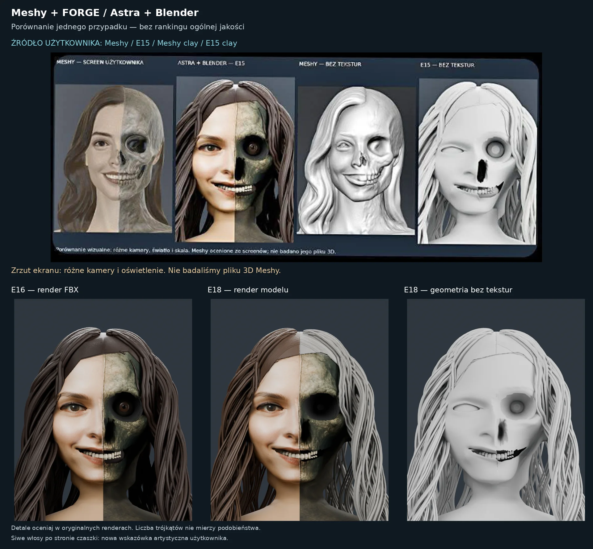
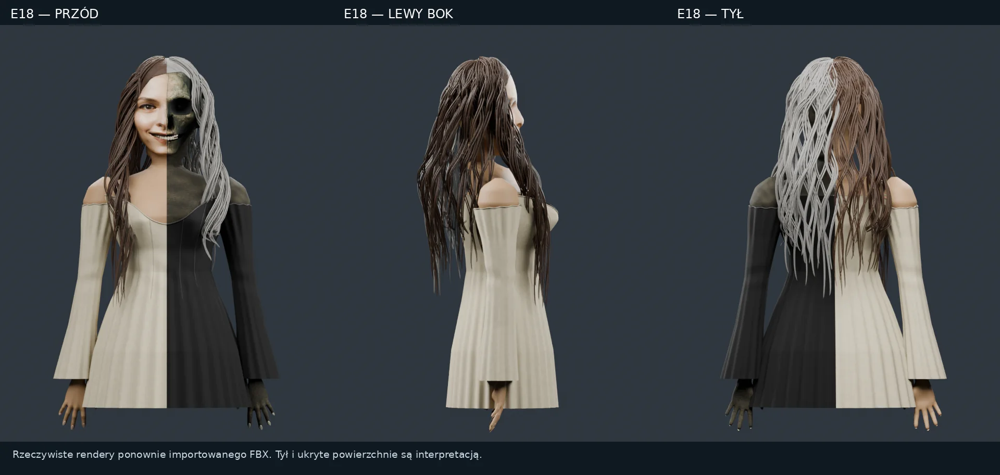

## Reference-driven 3D reconstruction — E18 working result

FORGE combines reference analysis, editable Blender scenes and repeatable export checks. We are developing a workflow for game assets and custom objects such as chess sets, globes and decorative tableware. The public experience is intended to remain simple: describe an object, inspect a preview and prepare a manufacturing enquiry.

Our current character study exposes a real limitation: **the supplied Meshy result follows the reference more closely than our E15/E16 model**, especially around the eyes, smile, hair roots and clothing. Meshy is a strong complementary tool. Our approach adds explicit constraints, named editable parts, local repairs and repeatable checks; those capabilities do not by themselves establish better visual quality.

Sebastian also reported an earlier example where our workflow followed the geometry of a fan more accurately. That observation is retained as a regression case to reproduce, not presented as a measured general advantage. The goal is to combine useful approaches and improve the outcome for the artist.

E17 introduced thinner hair, 3,920 geometric fibres, local tooth-crown adjustments and small torso/garment relief changes. E18 adds 440 root fibres, reshapes the orbital region, recesses the skeletal eye, refines the cheek/jaw and narrows the open region under the teeth. Its re-imported FBX contains 6,315,947 triangles and 369 UV-mapped mesh objects, with no missing active texture images in the reported import. The edits are visible, but hair grouping, eyelids, the lower nose and mouth transitions still require work. E18 is not accepted as a faithful or production-ready reconstruction.

The reference remains the authority for visible features. The newly requested grey hair on the skeletal side is a deliberate art-direction change; it must not be scored as exact colour reproduction of the earlier brown-haired reference. Procedural skin pores exist only in the Blender master; they were not baked for FBX/GLB. The preserved global head proportions avoid the rejected R15 enlargement. E18 contains local skeletal edits, but it does not reconstruct the complete skull or rebuild the living eyelids.

Our learning record stores failures, preferred revisions, reference requirements and acceptance checks. This is **application memory and evaluation work**, not a claim that the weights of OpenAI's Astra model have been retrained. OpenAI's documentation distinguishes evaluation, prompt improvements and fine-tuning as separate activities. [OpenAI model optimization](https://developers.openai.com/api/docs/guides/model-optimization)

The generator patch adds reconstruction instructions to the planner and emits reference-review evidence from the worker. It binds model, reference and review-image hashes, with an explicit refresh command after new evidence is supplied. It also measures tagged 8×8 and 8×8×8 board geometry and eligible flat material colours. Sixteen CPU regression tests and real Blender checks on 64/512-cell fixtures are reported; wrong materials and missing cells are detected. These tests do not measure facial likeness or texture pixels. Independent visual evidence still requires a reviewer, and the anatomy gate covers a single character. [Workflow review](GENERATOR-REVIEW.md)

See [the visual comparison](COMPARISON-E17.md), [the reconstruction prompt](PROMPT-E17.md), [the error catalogue](error-catalog.json), [the production workflow](PRODUCTION-WORKFLOW.md) and [comparison provenance](comparison-manifest.json). Model availability, tests actually run and remaining defects must be read with the accompanying artifact report. A saved export or a higher polygon count does not constitute visual acceptance, animation readiness or manufacturing approval.

The intended B2B workflow quotes material usage, colours, manufacturing process and finishing before an order is accepted. A preview and a quote form are not a claim that payment, supplier assignment or physical fulfilment is already operating.
