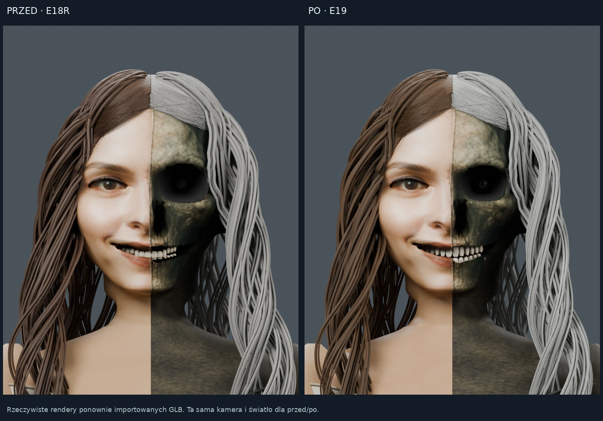
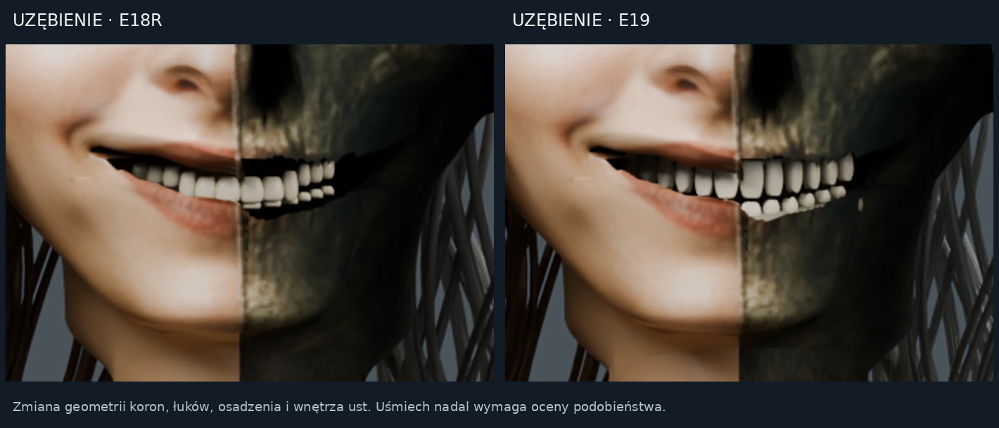
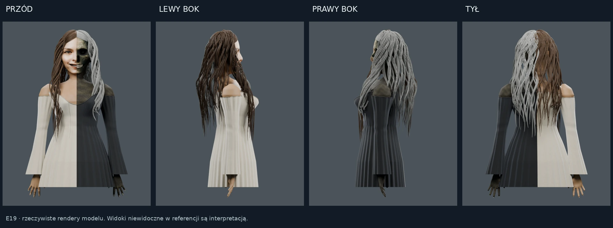
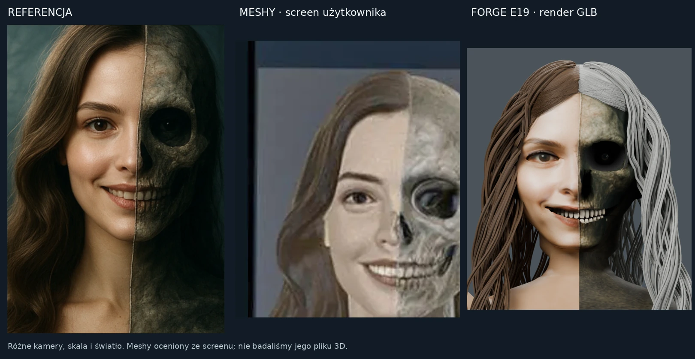

# E19 — korekta modelu, porównanie z Meshy i warunki produkcji

Stan: 13 września 2026. E19 jest korektą postaci w sukni na podstawie E18R. Nie jest nową Julią w bluzie ani Atlasem. Model i tekstury rzeczywiście wygenerowano w Blenderze 4.3.0. To rezultat roboczy, bez zatwierdzenia idealnego podobieństwa i bez dopuszczenia do fizycznej produkcji.

## Co zmieniono w pliku

| Obszar | Wykonana korekta | Dowód i granica wniosku |
|---|---|---|
| Zęby i uśmiech | 18 starszych obiektów zastąpiono 24 koronami: po 12 w łuku górnym i dolnym; zróżnicowano szerokość i kształt, dodano cztery łoża korzeni | Nowe siatki są zamknięte. Badane próbki korzeni wchodzą w łoża. Nakładanie brył nie jest ich unią. To zestaw widoczny w tej kreacji, nie kompletne 32-zębowe uzębienie |
| Wnętrze ust | Usunięto wcześniejszą jamę ustną przesuniętą około 3 cm powyżej łuku; dodano zamkniętą, cofniętą głębię na wysokości zębów | Kontrola dotyczy położenia i zamknięcia nowej geometrii; profil i okolice ust nadal wymagają oceny |
| Oko kostnej połowy | Nowe ciemne oko, tęczówka i źrenica, osadzone głębiej; średnica gałki 24 mm w skali źródła | To interpretacja oka obecnego na referencji. Nie jest domyślną cechą medycznej czaszki |
| Oczodół i głowa | Lokalna korekta pionowego rozwarcia obręczy, do 10,5%; brak globalnego powiększenia głowy | Nie przebudowano całej czaszki. Obrys głowy zachowano, aby nie powtórzyć odrzuconego R15 |
| Szyja, ramiona, dekolt | Wspólna deformacja skóry, sukni i szwów; subtelniejsze obojczyki, kontury gorsetu, przedłużenie górnego brzegu szyi w objętość żuchwy | Maksymalna zmiana szyi około 28 mm; miejscowe podkreślenie konturu gorsetu jest powściągliwe. Nie wykonano z tego automatycznie jednolitej bryły |
| Włosy | Zwężono 312 rdzeni pasm; średni promień spadł z około 1,516 do 0,898 mm. Zachowano drobne włókna i 960 wcześniejszych włókien nasady | Nowych trójkątów włosów nie dodano. Dolny obrys zwężono najwyżej o 3,5%, odsunięcie włosów z tyłu zmniejszono najwyżej o 9 mm. Długie pasma nadal miejscami wyglądają sztucznie |
| Skóra | Trzy nowe mapy 8192 × 8192 px dla torsu/szyi, po naprawieniu 124 trójkątów UV przy szwie | Proceduralne detale, nie nowy fotograficzny skan. Twarz zachowuje wcześniejszą teksturę o niższej rozdzielczości |

Źródła pomiarów: [raport budowy](final/build-report.json), [zęby i oczodół](dental/README.md), [kontrola nowych siatek](dental/dental-verification.json), [ciało i bake](body/README-body-8K.md), [włosy](hair/README-Hair-E19.md). Odrzucone eksperymenty włosów o wyglądzie regularnej zasłony nie należą do finalnej korekty.

## Co rzeczywiście oznacza 8K

Mapy mają 8192 × 8192 piksele na cały atlas torsu/szyi, włącznie z marginesem i niewykorzystanym obszarem UV. To nie 8K na każdy fragment ciała. Base Color zawiera nową proceduralną zmienność żywej skóry oraz odziedziczony kolor powierzchni kostnej. ORM zawiera stałe AO=1, nową roughness i metalness=0. Normal jest bake'iem detalu porów i powierzchni kostnej w przestrzeni stycznej.

Nie wypalono oświetlenia ani cieni w kolorze skóry. Detal normal wpływa na światło w renderze, **nie tworzy drukowalnej rzeźby porów**. Tekstura twarzy pozostała wcześniejsza i ma niższą rozdzielczość. Model nie może być reklamowany jako pełny fotograficzny skan twarzy 8K.

| Eksport | Rozmiar | SHA256 | Zakres tekstur |
|---|---:|---|---|
| `FORGE-E19-8K.glb` | 64 211 024 B | `f5196a7e6b822d50bbfdaa9d7f6051919b7d48a2e6a84fa5f3082cfc45c5e4f9` | Atlas ciała 8K; twarz odziedziczona |
| `FORGE-E19-web.glb` | 27 521 620 B | `08b88ea54b5046e579a9dab0e4f85342ffabdf3b9ed5932c3d49a00ec2b63cb4` | Atlas ciała zmniejszony do 2K |

Raport wspólnej sceny podaje **6 384 581 trójkątów i 379 obiektów siatkowych**. Należy sprawdzać hash konkretnego eksportu przy porównaniu; późniejsza optymalizacja web może zmienić hash i rozmiar. Wartości powyżej opisują pliki z raportu budowy, nie automatycznie każdy przyszły plik pod tym samym tytułem.

## Meshy i FORGE — uczciwa ocena dostępnych przykładów

Źródła Meshy to przesłane przez użytkownika screeny, w tym widok bez tekstur. Nie mamy jego eksportu do ustawienia identycznej kamery, światła i skali ani do analizy brył. Archiwalne [zestawienie Meshy / E16 / E18](../e17/COMPARISON-E17.md) pozostaje oceną tych konkretnych wyników. Nowe zdjęcie ekranowe nie jest dowodem pomiarowym produkcyjnej jakości całego pliku.

| Przypadek | Co przemawia za Meshy w dostarczonym materiale | Co wnosi FORGE / Astra + Blender | Czego nie ustalono |
|---|---|---|---|
| Złożona postać, twarz i uśmiech | Screen pokazuje bliższe podobieństwo do referencji i bardziej ciągłe przejścia policzka, ust i żuchwy | E19 umożliwia poprawkę konkretnych łuków zębowych, cofniętego oka i głębi ust z raportem zmian | Nie wykazano, że E19 zrównał się z Meshy w podobieństwie; brak wspólnego porównania dwóch importowanych modeli |
| Czaszka i profil | W dostępnym clay większe formy są bardziej spójne niż w starszym FORGE | Można osobno kontrolować brzeg oczodołu, gałkę, szczękę, łuki i szyję | Nie zbadano niewidocznych stron modelu Meshy ani całej anatomii E19 |
| Włosy | Duże falujące masy na screenie lepiej odpowiadają referencji | Drobne włókna, oddzielne rdzenie pasm, lokalne zmiany grubości i materiałów pozostają edytowalne | Więcej włókien nie dowodzi lepszego realizmu; FORGE nadal ma regularne grupowanie pasm |
| Materiały i skóra | Wygląd referencyjny jest przekonujący w dostarczonym ujęciu | Udokumentowane mapy ciała 8K, UV i semantyka kanałów; E18R usunął błędny biały sheen czarnej sukni | Nie porównano map obu plików, pokrycia UV ani faktycznej ilości detalu twarzy |
| Królowa Neptuna i wachlarz | Brak aktualnego, porównywalnego eksportu Meshy tego samego zadania | Zachowany model wachlarza i wcześniejsza obserwacja użytkownika o lepszym układzie jego geometrii | To obserwacja konkretnej wcześniejszej próby, nie potwierdzona ogólna przewaga |
| Szachownice 64/512 pól | Użytkownik zgłaszał błędną liczbę pól lub kolory wcześniejszych prób | Mierzalne sprawdzanie liczby, pozycji i naprzemienności przypisanych materiałów; celowe błędy wykrywane w testach | Test nie mierzy dowolnej fotograficznej tekstury szachownicy i nie jest nowym benchmarkiem Meshy |
| Produkt fizyczny | Screen nie pozwala zatwierdzić bryły, grubości i podpór | Jest audyt wejściowego E18R i osobny proces przygotowania kopii produkcyjnej | Żaden dostępny screen nie dowodzi gotowości do sprzedaży ani przewagi w druku |

Meshy jest wartościowym narzędziem rekonstrukcji obrazu i mocnym punktem odniesienia. Astra + Blender może uzupełnić taki proces przez lokalne poprawki, parametryczne części i weryfikację. W tych próbach Meshy lepiej odtwarza część cech referencji; zalety edycji FORGE nie są automatycznie przewagą wizualną. Nie przyznajemy zmyślonych procentów podobieństwa ani rankingu całych produktów.

## Dlaczego master wizualny nie jest jeszcze produktem fizycznym

Audyt dotyczył **wejściowego E18R**, SHA256 `6f8bef167a6d0e9dc67d4fce67df3782f0bdffb69ede54f8f62a799520f5b6db`. Wykryto 19 001 krawędzi otwartych, 44 024 krawędzie należące do więcej niż dwóch trójkątów, 8 481 niespójnych kierunkowo krawędzi i 121 092 trójkąty zdegenerowane. Połączono jedynie identyczne pozycje na potrzeby analizy szwów UV; nie zamykano szczelin tolerancją. **Nie wolno przypisywać tych liczb nowemu E19 bez jego osobnego audytu.**

Oddzielna próbka kontrolna walca i kuli przeszła konwersję oraz ponowny import: jedna składowa, 53 916 trójkątów i zero wykrytych błędów topologii. To sprawdza skrypt oraz jednostki, nie dopuszcza postaci E19. Szczegóły w [audycie](audit/PRODUCTION-AND-MESHY-REVIEW.md).

Dla zamówienia potrzebne są osobne dowody dotyczące:

- uzgodnionej wysokości, jednostek, procesu i materiału;
- zamknięcia objętości, połączenia części, przecięć i wewnętrznych powłok;
- minimalnej grubości szczegółów, podparcia włosów, palców, zębów i dodatków;
- podstawy, stateczności, podpór lub dostępu narzędzia;
- podglądu kopii produkcyjnej oraz akceptacji próbki i technologii przez wykonawcę.

Wypełnienie w slicerze nie jest tym samym co zamknięta powierzchnia modelu. Ustawienie „100%” nie naprawia geometrii. Dla obróbki kamienia lub procesu laserowego wykonawca musi określić konkretną maszynę, materiał, zakres reliefu i wymagane dane. Nie wygenerowano zatwierdzonych ścieżek CAM, parametrów lasera ani programu maszyny. Plik GLB z kolorami nie jest sam w sobie takim programem.

## Audyt i poprawianie bez utraty wcześniejszego wyniku

1. Zachować poprzedni model, referencję i ich SHA256. Wybrać nazwany region wady.
2. Wykonać lokalną korektę, wyeksportować i ponownie zaimportować wynik.
3. Porównać przód, oba profile, tył, zbliżenie twarzy oraz widok bez materiałów przy tych samych ustawieniach. Dla uzębienia dodać skos od dołu.
4. Oddzielnie pokazać klientowi podobieństwo i listę usterek; nieudana próba pozostaje dostępnym draftem.
5. Ponowić pomiary geometrii i kontrolę tekstur dla bieżącego hash-u. Nie przenosić oceny starej rewizji na nową.
6. Zatwierdzić wygląd niezależnie od specyfikacji produkcji. Wykonawca dopuszcza konkretną kopię fizyczną po badaniu procesu.

Host gate v35 kontroluje status i dowody; kompletny automatyczny pakiet sześciu widoków i pomiarów nadal wymaga integracji. Nowy moduł audytu produkcyjnego jest osobnym narzędziem do dalszego podłączenia — obecność skryptu w repo nie oznacza działającej blokady endpointu zamówień na Oracle. Nie wykonano treningu wag modelu, nowego L4 ani płatnego treningu na światowych bazach danych.

## Potwierdzone rendery E19

Ponowny import obu GLB potwierdził **6 384 581 trójkątów**. Master zawiera trzy obrazy 8192 × 8192 px, wersja internetowa atlas ciała 2048 × 2048 px. Powstało sześć widoków E19 i dodatkowe zbliżenie ciała z mastera. [Manifest renderów](final/render-verification.json) zawiera skróty plików oraz rzeczywiste wymiary obrazów.

Audyt finalnego **wizualnego** E19 wykazał 19 001 otwartych krawędzi, 47 116 krawędzi o więcej niż dwóch incydentnych ścianach i 124 634 zdegenerowane trójkąty po dokładnym połączeniu identycznych pozycji. To diagnostyka zbioru osobnych części, nie test scalonej bryły. [Pełne dane E19](audit/E19-production-audit.json). Duża część problemów dotyczy włosów. Liczba trójkątów nie oznacza gotowości produkcyjnej.

Osobna kopia produkcyjna jest opracowywana niezależnie i wymaga własnego raportu. Master wizualny pozostaje zablokowany do sprzedaży jako gotowy plik do wykonania fizycznego.
