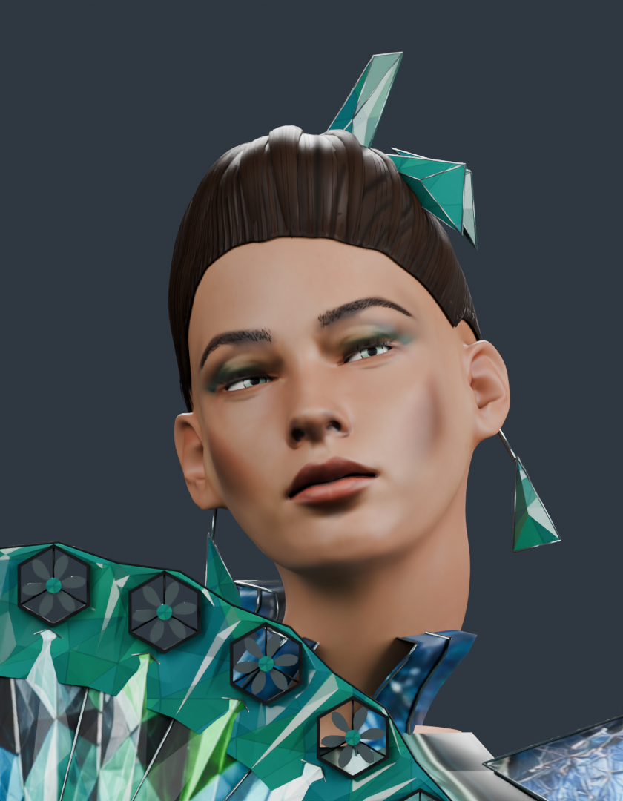
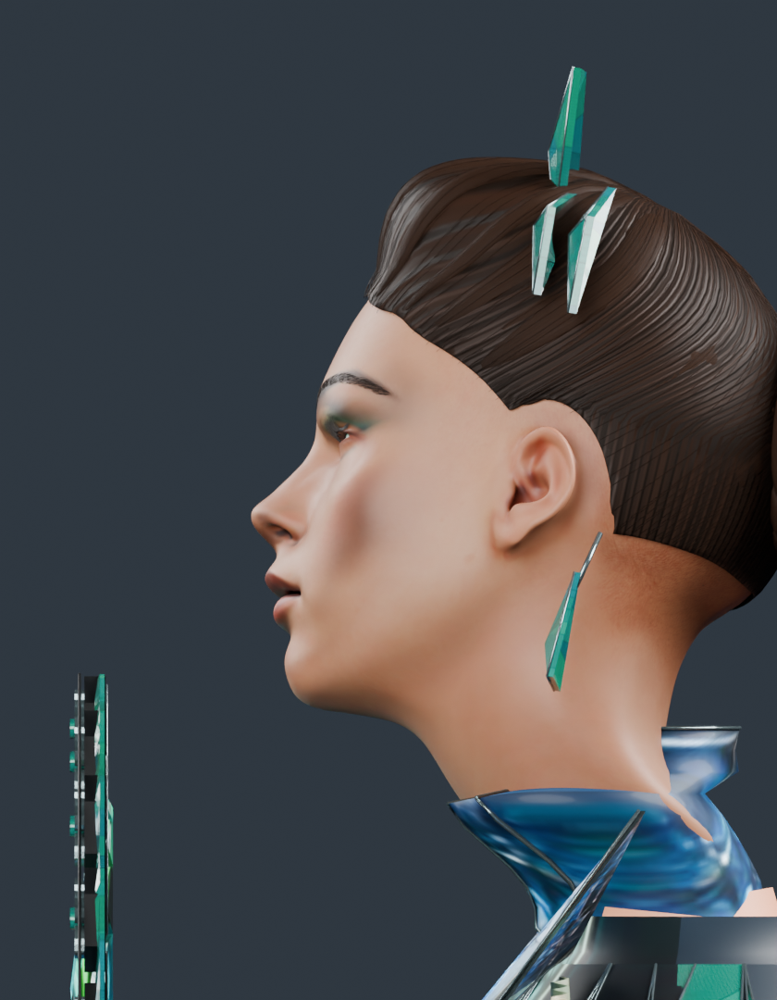
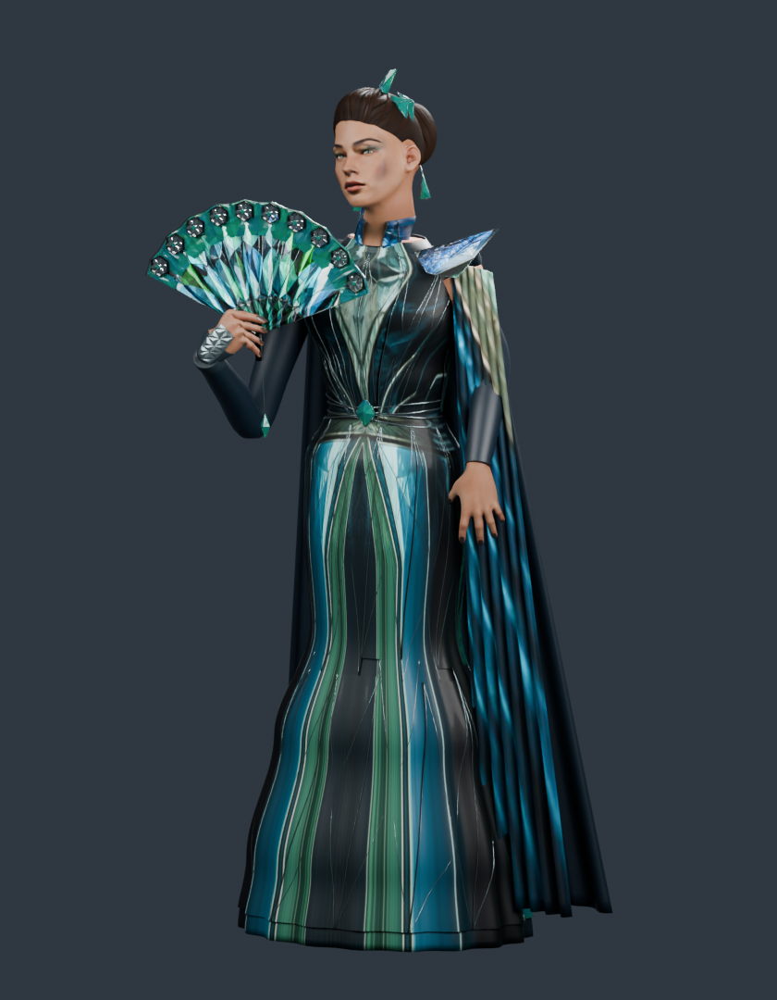
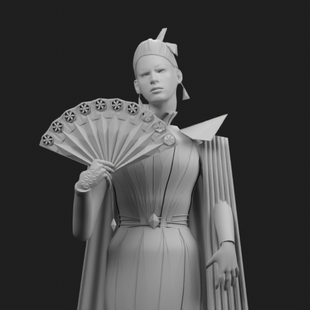
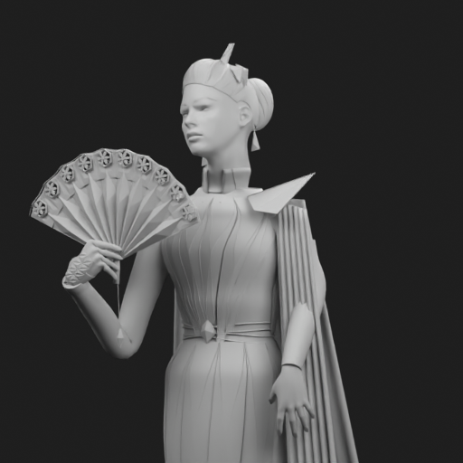

# FORGE — wykonana aktualizacja generatora

Zmiany zapisano w istniejącym draft PR #8. Model poniżej został zbudowany przez runtime FORGE z zapisanej sceny i przesłanej fotografii; nie jest podmienionym modelem Meshy.

- Fryzura ma obniżony kark i skronie oraz łuk nad uchem. Pierwszy render ujawnił nachodzenie na ucho; poprawiono obrys i powtórzono eksport.
- Dopasowanie twarzy przesuwa oczy bez deformowania ich lokalnej siatki i okrągłych tęczówek.
- Detale materiałów są liczone od nowa w większej rozdzielczości. W tym modelu mapy włosów mają 4096×2048; kryształ i mikrostruktura skóry 2048×2048. Atlas skóry zachowuje źródłowe 2048×2048, a fotografia 1229×1536. Nie powiększono źródłowych zdjęć. Pory i pasma są detalem autorskim, nie odzyskanym ze zdjęcia.
- Pełny zestaw PBR 8192×8192 + trzy mapy 4096×4096 przeszedł rzeczywisty test produkcyjnej funkcji eksportu i GLB. Zachowano bajty koloru i normalnej, a kanały roughness/metallic sprawdzono na pikselach. Fixture używa map Meshy na sześcianie i weryfikuje transport materiałów, nie generowanie podobieństwa.
- Osobny budżet materiałów ma limit 192 Mi pikseli i kontrolę szacowanego RAM. Profil 8K używa kontenera 8 GiB po sprawdzeniu 10 GiB dostępnej pamięci przed AI. Profil zwykły pozostaje przy 4 GiB. Pełny zestaw PBR jest odrzucany pod 4 GiB przed zmianą obrazów. Test pamięci jest polityką i estymacją; nie zmierzono maksymalnego RSS produkcyjnego kontenera Oracle.
- Master .blend i GLB zachowują geometrię bez decymacji; 4K/8K wyłącza kwantyzację pozycji. Historia i powtórzenie zachowują wybrany limit.

Model: 304329 wierzchołków przed eksportem, 592136 trójkątów, 100 obiektów, 14 obrazów. GLB 39711312 bajtów. SHA256 i rozmiary w artifacts.json. Sprawdzono ponowny import, UV, materiały, twarz, 2 oczy, 2 dłonie, 10 paznokci, rzęsy, chwyt oraz istniejące kontrole stroju.

Walidacja: 123 testy Python, 70 testów interfejsu/API, poprawna kompilacja strony, realna generacja Blender 4.3.0 oraz test pełnych map PBR. Trzy poniższe obrazy to rendery GLB 840×1080, nie rendery 4K.

Szare modele po ponownym imporcie (kontrola kształtu bez koloru):

Nadal do poprawy: zgodność konkretnych rysów twarzy, kształt wysokiej fryzury, kołnierz, ogólne proporcje i fałdy sukni. Tył i dół są szacowane. Większe mapy ani testy techniczne nie dowodzą jakości Meshy. Brak akceptacji fotograficznego podobieństwa, przydatności do druku i riga do gry.

To aktualizacja kodu generatora i pakiet instalacyjny. Nie zmieniono wag AI, nie wywołano płatnego AI, nie zainstalowano pracownika na Oracle i nie opublikowano strony. Wersja 38 pozostaje aktywna.
