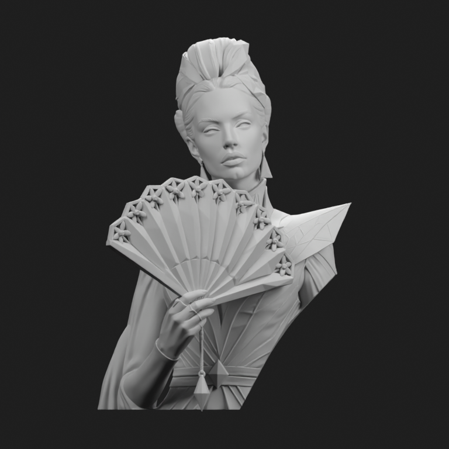
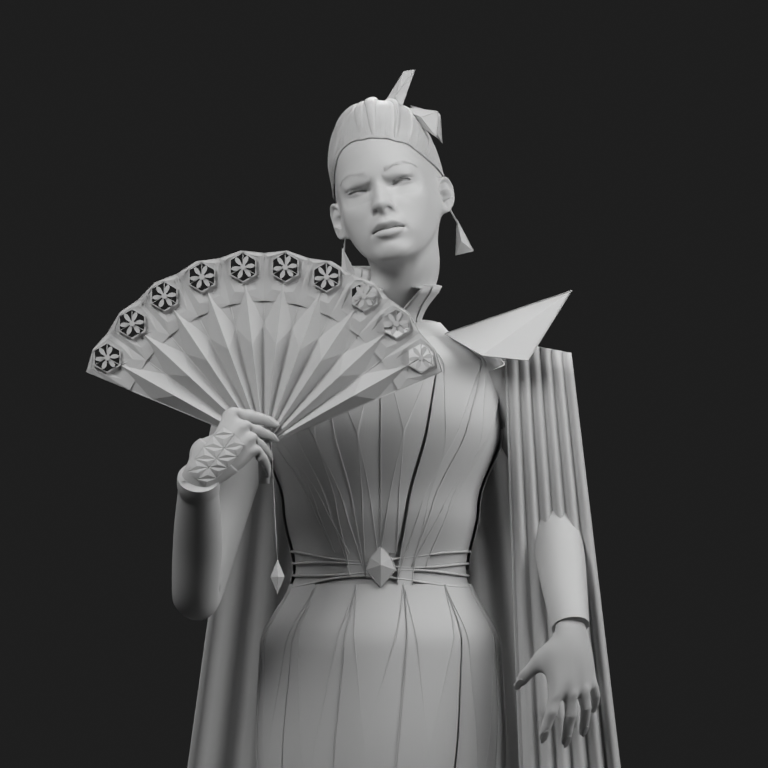
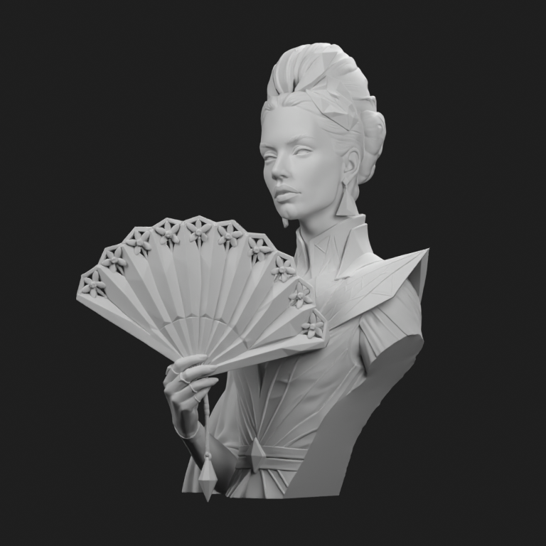
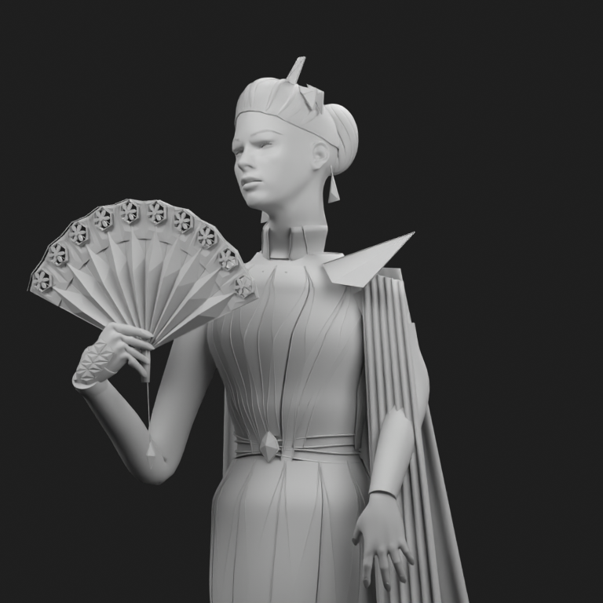
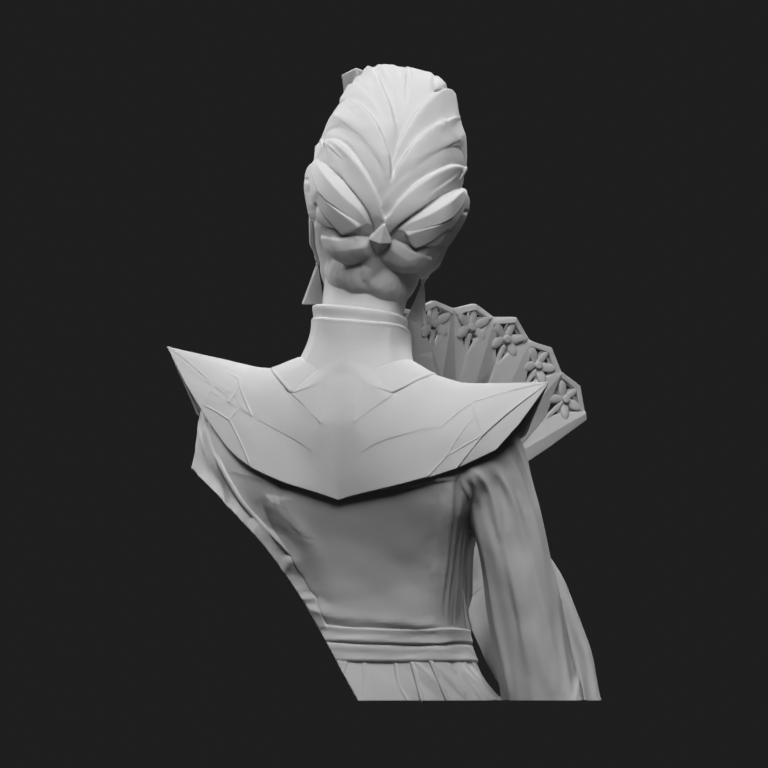
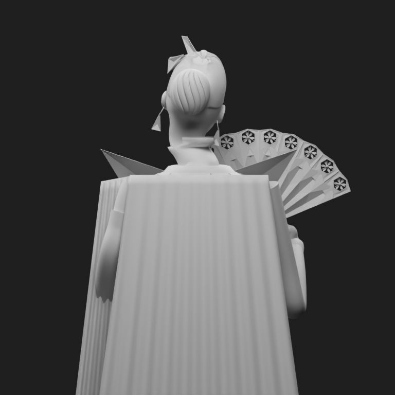

# Meshy reference: geometry baseline, 2026-09-10

Sebastian supplied a Meshy bust as the target for better reference fidelity. We imported the actual FBX and compared it with the last production FORGE couture GLB. This update adds a repeatable asset inspector and acceptance requirements to draft PR #8. It does not replace the generator with the Meshy asset, train weights, or claim comparable output quality.

## Measured files

| Measurement | Supplied Meshy FBX | Current FORGE GLB |
| --- | ---: | ---: |
| Triangles after import | 3,079,530 | 592,396 |
| Vertices after import | 1,539,459 | 351,497 |
| Mesh objects | 1 | 100 |
| UV layers | None | Present on all mesh objects |
| Used image textures | 0 | 14 |
| Largest loaded image | None | 2048 × 2048 |
| Coverage | Bust | Full figure with inferred lower body |

Counts are not a likeness score. The bust and full figure have different scope. FORGE reports 304,459 vertices before GLB export; its reimport has 351,497 because exported attributes split vertices at seams. Triangle counts agree. Imported boundary edges can similarly reflect split indices, not holes. The Meshy mesh has two edges incident to more than two faces; this audit alone does not establish printable topology.

The first, untextured FBX has no UVs, material slots or images. The initial texture ZIP upload failed, but the subsequent upload is now verified: an 8192 × 8192 base-color PNG and three 4096 × 4096 PBR maps, with a UV-mapped textured FBX. See the [texture follow-up, native material audit and actual GLB renders](TEXTURES.md). The earlier missing-file status is resolved.

Source hashes and full measured reports: [Meshy](meshy-asset-inspection.json), [FORGE](forge-asset-inspection.json). The 99,865,372-byte FBX remains the user's input and is not committed as a generator asset. The reports bind all renders to the source files by SHA-256.

## Actual neutral-material renders

These images were rendered from imported geometry in Blender 4.3.0, using a neutral material override, orthographic cameras and identical studio settings. FORGE uses `--lower-crop 0.5` to frame the upper half of the full figure. This is approximate review framing, not registered multi-view correspondence or a pixel metric. No mesh smoothing, remeshing, decimation, repair or AI image generation was applied.

| View | Meshy reference | FORGE current output |
| --- | --- | --- |
| Front |  |  |
| Three quarters |  |  |
| Back |  |  |

The Meshy front retains more of the visible cheek/lip shape, swept hair around the ears, collar, hand/fan relationship and diagonal garment folds. FORGE still has a generic face and gaze, an overly simple crest/undercut, disconnected collar shapes, differently proportioned fan and torso, and different cloth folds. Neither a larger atlas nor a higher polygon cap fixes these reconstruction differences. The single source photograph does not verify the back of either model.

## Required next geometry work

1. Use the visible bust as the first acceptance region. Improve face/profile, hairline and hair around the ear, collar/shoulder contours, sleeve/glove and grip before adding unseen anatomy.
2. Change the geometry fitting and garment construction, keeping the measured source and previous versions. Do not merely subdivide the current generic geometry or import this example as a generated FORGE result.
3. Maintain a detailed master and separately derived viewer LOD. Texture-only work must preserve geometry, UVs, pose and material assignments.
4. Review neutral and textured exports after GLB reimport. Record actual map dimensions and missing dependencies; do not infer 8K detail from a selector or image enlargement.
5. Keep PR #8 draft until visual fidelity is accepted. No Site/Oracle deployment was performed for this benchmark.

## Reproduce

Use the provided FBX and the generated GLB whose hashes match the reports. The inspector reads the source and writes only its report/renders to the output directory. FBX image searching is disabled. It does not save an edited model or repair the input.

```bash
blender -b -t 4 --disable-autoexec --python-exit-code 1 \
  --python scripts/inspect-reference-asset.py -- \
  --input /path/Meshy_AI_Emerald_Prism_Empress_0910195448_generate.fbx \
  --output /tmp/meshy-review --render-clay

blender -b -t 4 --disable-autoexec --python-exit-code 1 \
  --python scripts/inspect-reference-asset.py -- \
  --input /path/model.glb --output /tmp/forge-review \
  --render-clay --lower-crop 0.5

blender -b --python-exit-code 1 \
  --python scripts/verify-reference-asset.py -- /tmp/asset-audit-tests
```

Default success means a finite surface mesh was inspected, not visual acceptance. Optional `--require-textures` requires UVs and loaded base-color images for every used material. Optional `--min-base-color-edge 4096` additionally checks those connected images; an unused 8K image cannot make a 4K material pass. These strict options are for texture-completeness fixtures and must not reject intentionally constant-color materials in the production generator. Graph traversal supports ordinary imported Principled shaders; custom node groups need manual review. Dimensions do not prove native detail or calibrated albedo.

Verification evidence is in [inspector-verification.json](inspector-verification.json). Five native Blender regression cases cover closed/open geometry, missing materials, unconnected 8K images, missing texture files and absent UVs. Both actual input models were inspected and rendered; no broad application retest is needed for this standalone inspector and documentation change.
