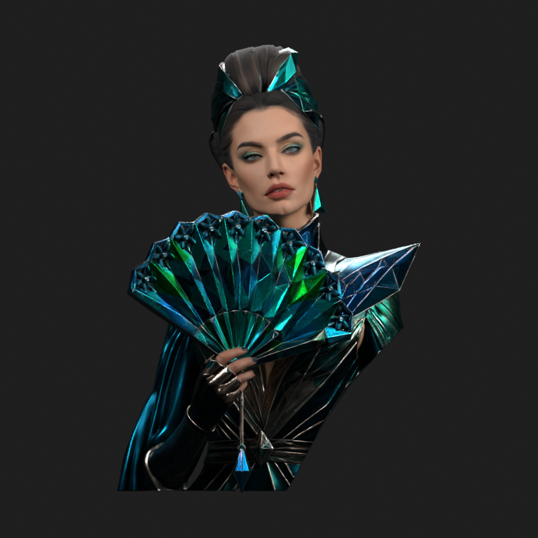
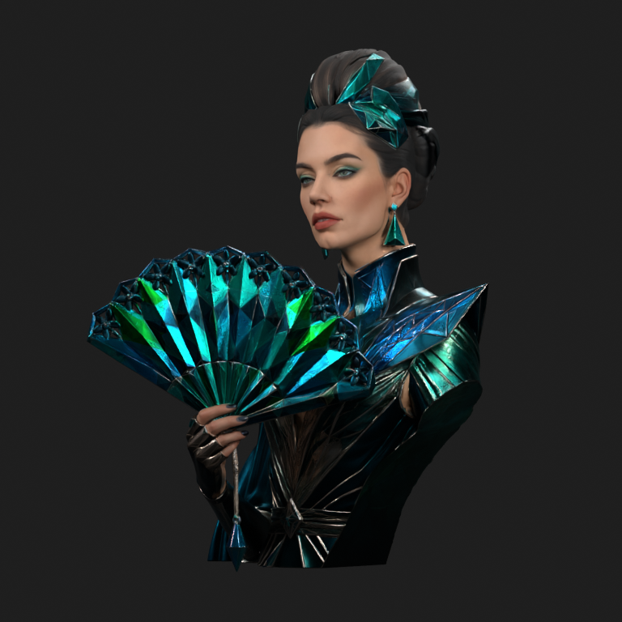
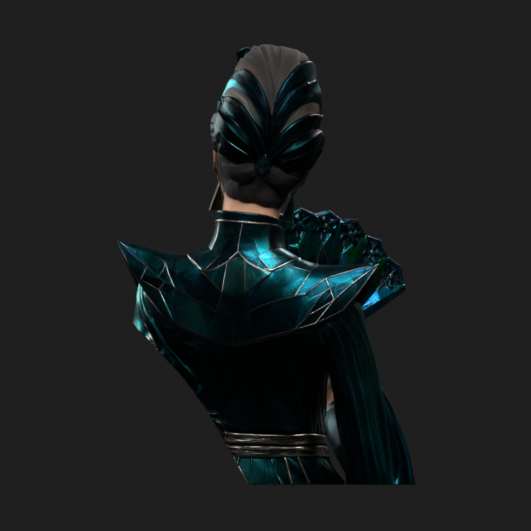

# Meshy — zweryfikowany wzorzec tekstur

Ponowny upload ZIP-a dotarł i został sprawdzony. Paczka ma 290 480 457 bajtów; odczyt wszystkich plików przeszedł kontrolę CRC. [Manifest](texture-archive-inspection.json) zawiera rozmiary i SHA-256 każdego pliku.

| Mapa PNG | Rzeczywisty rozmiar | Interpretacja |
| --- | --- | --- |
| Kolor bazowy | 8192 × 8192 | sRGB |
| Normalne | 4096 × 4096 | Non-Color, istniejący węzeł normalnych |
| Metaliczność | 4096 × 4096 | Non-Color |
| Chropowatość | 4096 × 4096 | Non-Color |

Teksturowany FBX ma jedną siatkę z UV, jeden materiał, 1 539 459 wierzchołków i 3 079 530 trójkątów. Wszystkie cztery kanały są podłączone i wczytane. Potwierdza to [audyt FBX](texture-native-fbx-inspection.json).

FBX osadza kolor i normalne jako JPEG, a dwie pozostałe mapy jako PNG. Dostarczone obok pliki są PNG. Do testowego GLB podłączono właśnie te zewnętrzne PNG, zachowując istniejące połączenia materiału i węzeł normalnych. Nie zmieniano geometrii, UV ani przypisania materiałów. Zapis PNG pozwala uniknąć kolejnej stratnej kompresji; nie dowodzi pochodzenia ani autentyczności wygenerowanych detali.

## Eksport i ponowny import

Blender 4.3.0 wyeksportował GLB i ponownie go otworzył. Kolor 8K i normalne 4K zachowały identyczne bajty PNG ze źródła. Metaliczność i chropowatość zajmują osobne kanały jednej mapy 4096 × 4096. Geometria, UV i indeksy materiałów w scenie nie zmieniły się podczas podłączenia PNG ani eksportu.

Po imporcie GLB nadal jest 3 079 530 trójkątów. Wierzchołków jest 1 596 454 wskutek rozdzielenia atrybutów przy eksporcie. Maksymalna różnica granic modelu wynosi `5.960464477539063e-08` jednostki sceny. [Pełny raport](texture-verification.json) zawiera wyniki, rozmiary i hashe plików. Testowy GLB ma 195 389 204 bajty i SHA-256 `ed3cd1eebe0f2db141d20b43c5d4ac6228862660253e3b5476f92b645ed61aa7`.

Szary i teksturowany FBX mają inną kolejność wierzchołków i ścian. Sam różny hash albo odległość punktów o tym samym numerze nie dowodzi deformacji. [Osobne porównanie](texture-geometry-comparison.json) dopasowuje punkty przestrzennie i sprawdza zbiór trójkątów wraz z orientacją. Porównanie przeszło: zbiór trójkątów i orientacje są zgodne po dopasowaniu, a największa odległość punktów wynosi `8.775253377280023e-07` jednostki sceny przy tolerancji `1e-6`. Nie deklarujemy identycznych bajtów obu siatek.

## Rzeczywiste rendery dostarczonego modelu

Poniżej model Meshy z jego zewnętrznymi mapami PNG, po ponownym imporcie GLB. To wzorzec do oceny FORGE. Oświetlenie studyjne różni się od podglądu Meshy; pierwotne zdjęcie nie potwierdza wyglądu pleców.

| Przód | Trzy czwarte | Tył |
| --- | --- | --- |
|  |  |  |

## Konkretne ograniczenie naszego eksportu

Cztery źródłowe mapy zawierają **117 440 512 pikseli**, czyli 112 Mi pikseli. Same bufory RGBA32F wymagają szacunkowo 1 879 048 192 bajtów, czyli 1,75 GiB. Siatka, renderer, koder oraz tymczasowe kopie wymagają dodatkowej pamięci. To szacunek buforów, nie zmierzony całkowity RAM procesu.

Obecny limit FORGE wynosi **83 886 080 pikseli**, czyli 80 Mi pikseli. Nie przyjmie tego pełnego zestawu bez pomniejszenia. Nawet trzy obrazy w GLB po połączeniu metaliczności i chropowatości mają 100 663 296 pikseli, czyli 96 Mi pikseli. Test wykonano przez natywny eksport Blendera; nie zmieniono limitu pracownika.

Następna aktualizacja powinna wprowadzić osobny, zmierzony budżet materiałów, ograniczyć kopie obrazów i sprawdzić rzeczywisty RAM Oracle przed zwiększeniem limitów. Pełne mapy master i lżejsze mapy podglądu należy przechowywać osobno. Nie wystarczy podnieść rozdzielczości w selektorze. Limity fotografii wejściowych są odrębnym parametrem.

PR #8 pozostaje draftem. Ten etap weryfikuje wzorzec i dodaje narzędzia kontroli. Nie wytrenowano modelu, nie wdrożono rekonstrukcji jakości Meshy ani aktualizacji Oracle/Site.

## Odtworzenie kontroli

Rozpakuj ZIP, pozostawiając FBX i cztery PNG obok siebie pod oryginalnymi nazwami. Skrypt oczekuje jednego materiału oraz plików `name_texture.png`, `name_texture_normal.png`, `name_texture_metallic.png`, `name_texture_roughness.png`.

```bash
blender -b -t 4 --disable-autoexec --python-exit-code 1 \
  --python scripts/verify-meshy-textures.py -- \
  --input /path/Meshy_AI_Emerald_Prism_Empress_0910195350_texture.fbx \
  --geometry-reference /path/Meshy_AI_Emerald_Prism_Empress_0910195448_generate.fbx \
  --output /tmp/meshy-texture-review

blender -b -t 4 --disable-autoexec --python-exit-code 1 \
  --python scripts/compare-reference-geometry.py -- \
  --before /path/Meshy_AI_Emerald_Prism_Empress_0910195448_generate.fbx \
  --after /path/Meshy_AI_Emerald_Prism_Empress_0910195350_texture.fbx \
  --output /tmp/geometry-comparison.json
```

Ogólny audytor obsługuje teraz `--render-textured` jako alternatywę dla `--render-clay`. Pokazuje również sumę pikseli oraz szacunkowy rozmiar buforów RGBA32F. Ponownie przeszło pięć [testów audytora](texture-inspector-verification.json); cztery [testy porównania geometrii](texture-geometry-tests.json) wykrywają deformację, odwróconą ścianę i zastąpienie ściany duplikatem, a dopuszczają samo przestawienie indeksów.
