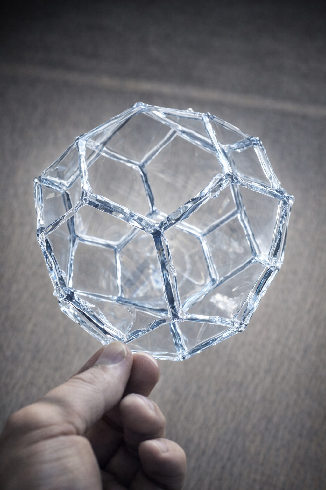
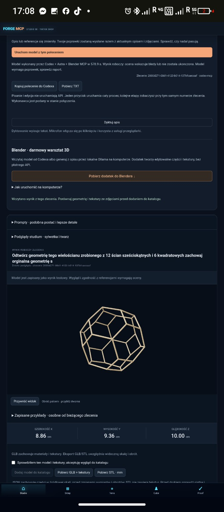
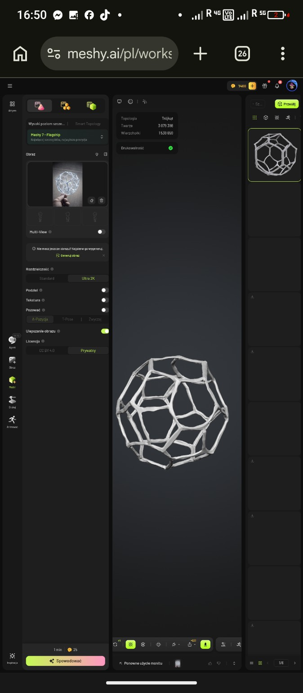

# Osiemnastościan Sebastiana: FORGE MCP i Meshy 7

**Data oceny: 13 września 2026. Zakres: jeden przypadek, pięć dostarczonych obrazów oraz odczyt metadanych zlecenia FORGE.**

W pokazanych ujęciach **FORGE MCP — Codex + Astra + Blender MCP — lepiej realizuje cel prostych, równych prętów i czytelnych naroży**. Meshy 7 odtwarza ogólną ażurową sylwetkę, lecz widoczne pręty falują, mają zmienną grubość i miejscowe zgrubienia. To przewaga wizualna FORGE w tym przypadku; nie jest to dowód, że Astra jest najlepszym generatorem 3D we wszystkich zadaniach ani potwierdzenie dokładnego odwzorowania całej bryły.

## Materiał dowodowy

| Dowód | Zawartość | Pochodzenie |
|---|---|---|
| R1 | Referencja obiektu trzymanego w dłoni | Obraz dostarczony przez Sebastiana |
| F1, F2 | Dwa widoki wyniku FORGE | Zrzuty ekranu 17:08:36 i 17:08:14 |
| M1, M2 | Dwa widoki wyniku Meshy 7 — Flagship | Zrzuty ekranu 16:50:44 i 16:50:15 |
| J1 | Rekord zlecenia FORGE, odczytany 2026-09-13 | Baza istniejącego prywatnego Studio |

Oryginalne obrazy są zachowane bez zmiany bajtów w katalogu `public/comparisons/polyhedron-2026-09-13/assets/`. Interaktywna strona pokazuje powiększone fragmenty oryginałów i pozwala otworzyć pełny zrzut. Załączniki mają nazwy zakończone `.png`, lecz ich wykryty format to JPEG; publikujemy je jako `.jpg`, bez rekompresji. Kadrowanie podglądu nie zmienia pliku dowodowego. Zrzuty ekranowe są oznaczone jako zrzuty; w tej ocenie nie wykonano nowych renderów ani generacji.

## Obrazy porównawcze

| Referencja R1 | FORGE F2 | Meshy M2 |
|---|---|---|
|  |  |  |

Drugi widok: [FORGE F1](../../../public/comparisons/polyhedron-2026-09-13/assets/forge-170836.jpg) · [Meshy M1](../../../public/comparisons/polyhedron-2026-09-13/assets/meshy-165044.jpg). Są to całe zrzuty, z zachowanym kontekstem interfejsu. Czytelną stronę z powiększonymi kadrami przygotowano w [index.html](../../../public/comparisons/polyhedron-2026-09-13/index.html); wdrożenie na Studio pozostaje zablokowane błędem HTTP 500 przy pobieraniu źródeł Sites.

## Ocena porównawcza

| Kryterium | FORGE MCP | Meshy 7 | Co można stwierdzić |
|---|---|---|---|
| Prostoliniowość widocznych prętów | Odcinki wyglądają prosto i regularnie | Widoczne falowanie i lokalne wygięcia | Przewaga wizualna FORGE |
| Grubość i naroża | Pręty mają bardziej równą grubość, połączenia są czytelne | Niejednolite przekroje i zgrubienia węzłów | Przewaga wizualna FORGE |
| Ogólna sylwetka ażurowa | Zachowana bryła przestrzenna i otwarte pola | Zachowana bryła przestrzenna i otwarte pola | Oba wyniki przypominają ogólną konstrukcję referencji |
| Układ wszystkich ścian, krawędzi i wierzchołków | Brak pomiaru z eksportu | Brak pomiaru z eksportu | Niezweryfikowane dla obu |
| Dokładne proporcje, kąty i symetria 3D | Nie zmierzono | Nie zmierzono | Widoki mają inne kamery i perspektywę |
| Wygląd powierzchni | Jasnobeżowy szkielet, wizualnie uproszczony materiał | Jasny, nierówny szkielet; widoczne zgrubienia | Żaden zrzut nie potwierdza wiernego materiału referencji |
| Usunięcie dłoni i tła | Brak widocznej dłoni w wyniku | Brak widocznej dłoni w wyniku | Wizualnie osiągnięte w pokazanych ujęciach |
| Druk i poprawność siatki | Nie przeprowadzono audytu | Zielona etykieta „Drukowalność” w UI | Etykieta UI nie zastępuje niezależnego testu |

Nierówności Meshy mogą być istotne przy odtwarzaniu wyglądu powierzchni, ale nie realizują celu idealnie prostych odcinków. Ocena prostoliniowości odnosi się do celu geometrycznego Sebastiana. Sama referencja zawiera widoczne nierówności oraz odbicia światła; nie jest skalibrowanym rysunkiem technicznym.

## Liczby i stan wykonania

| Pozycja | Wartość | Rodzaj dowodu |
|---|---|---|
| Wymaganie Sebastiana | 18 ścian: 12 sześciokątów + 6 kwadratów | Opis zlecenia; nie pomiar wyniku |
| Zlecenie FORGE | `2000d271-08d1-4123-b014-137bfcaecaaf` | J1, potwierdzone w bazie |
| Silnik wykonania | `codex-mcp` | J1 |
| Czas FORGE | 578,9 s, czyli 9 min 38,9 s | Komunikat zadania, zgodny ze zrzutami |
| Wymiary podglądu FORGE | X 8,86 cm; Y 9,36 cm; Z 10,00 cm | F1/F2; nie wymiar fizycznej referencji |
| Trójkąty Meshy | 3 079 398 | M1/M2, licznik UI; nie niezależny odczyt pliku |
| Wierzchołki Meshy | 1 539 659 | M1/M2, licznik UI; nie wierzchołki szkieletu wielościanu |
| Trójkąty/wierzchołki FORGE | Nie ustalono | Licznika nie pokazano, eksportu nie zmierzono |
| Ustawienia widoczne w Meshy | Meshy 7 — Flagship, Ultra 2K; ulepszanie obrazu włączone | Zrzuty, bez pełnego zapisu konfiguracji |

J1 ma stan `succeeded` i nazwę artefaktu `2000d271-08d1-4123-b014-137bfcaecaaf.glb`, lecz jednocześnie zawiera komunikat: „Wynik roboczy: ocena wskazuje bledy lub nie zostala ukonczona. Model wymaga poprawek; sprawdz raport.” **Potwierdza to zapis wyniku, a nie zaliczenie oceny jakości.** Nie przypisujemy temu komunikatowi konkretnej przyczyny bez pełnej diagnostyki.

Zlecenie utworzono o 2026-09-13T14:57:52.856Z, a rekord zaktualizowano o 15:07:39.724Z. Różnica znaczników wynosi 586,868 s i obejmuje cykl obsługi rekordu; nie zastępuje czasu 578,9 s podanego przez wykonawcę. Nie ma porównywalnego pomiaru czasu Meshy ani rachunków kosztu, więc nie oceniamy szybkości i opłacalności.

## Kontrola geometrii 18 ścian

Jeżeli opis dotyczy zamkniętej powierzchni wielościanu bez uchwytów, każda krawędź należy do dokładnie dwóch ścian, a ściany są zwykłymi wielokątami, to:

```text
F = 12 + 6 = 18
2E = 12 × 6 + 6 × 4 = 96, więc E = 48
V − E + F = 2, więc V = 32
```

To **warunki kontrolne wymaganej geometrii**, nie wynik liczenia na załączonych obrazach. W zwykłym wypukłym wielościanie każdy wierzchołek ma co najmniej trzy krawędzie; przy tych liczbach wszystkie 32 wierzchołki musiałyby mieć stopień 3. Same liczby nie dowodzą poprawnego układu połączeń, płaskości ścian, regularności sześciokątów czy zgodności z referencją.

Należy liczyć abstrakcyjne węzły i pręty szkieletu, a nie trójkąty powierzchni prętów. Ażurowy model z grubych prętów ma inną topologię powierzchni swojej siatki niż matematyczna otoczka wielościanu. Miliony trójkątów nie potwierdzają poprawnej liczby ścian.

## Porównywalność i ograniczenia

- FORGE otrzymał opis, zdjęcie i dodatkowe instrukcje. W Meshy widać miniaturę tej samej kompozycji; pełnego promptu, seeda, historii prób i konfiguracji nie udostępniono. Nie jest to test z identycznym budżetem i wejściem.
- SHA-256 obecnie dostarczonej referencji to `ab6736e4b51061bb1676adad6229958097498a32b3f5ffe36f050ed70385daa7`. Rekord zdjęcia wejściowego FORGE zawiera `7e08a2fc32715796f9b920494218916b424a23d862ae5a4fd6cef6c323fc9e46`. Hashe są różne; nie potwierdzono identyczności bajtowej tych plików ani przyczyny różnicy.
- `textureMaxSize: 4096` w rekordzie wejścia jest limitem zdjęcia, nie dowodem wygenerowania tekstury 4K. „Ultra 2K” w Meshy jest ustawieniem UI, nie zmierzoną jakością detalu.
- Nie odczytano w tym raporcie eksportów obu modeli. Brak pomiarów płaskości, długości, kątów, samoprzecięć, grubości, spójności materiałów, UV, skali eksportu i tolerancji druku.
- Ocenę przygotowano w ramach projektu FORGE na prośbę jego autora, z użyciem asystenta AI. Nie jest to niezależny audyt ani szeroki benchmark produktów.

## Warunek pełnego zaliczenia

Do pełnego porównania potrzebne są GLB/BLEND lub FBX obu wyników i ustalenie układu ścian wzorca, najlepiej na podstawie widoków z kilku stron lub rysunku konstrukcji. Następnie należy wydzielić graf prętów, sprawdzić 18/48/32 oraz liczbę boków i sąsiedztwo ścian, zmierzyć prostoliniowość, płaskość i proporcje, obejrzeć oba modele w tej samej kamerze i oświetleniu, ponownie otworzyć eksporty oraz wykonać osobny test produkcyjny. Wyniki i przyjęte tolerancje należy zapisać, zanim model otrzyma pełną akceptację.

**Werdykt: FORGE wygrywa wizualnie w regularności widocznych krawędzi w dostarczonym przypadku. Pełna zgodność osiemnastościanu i gotowość do druku pozostają niezweryfikowane.**
