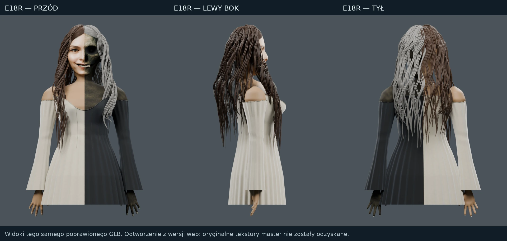
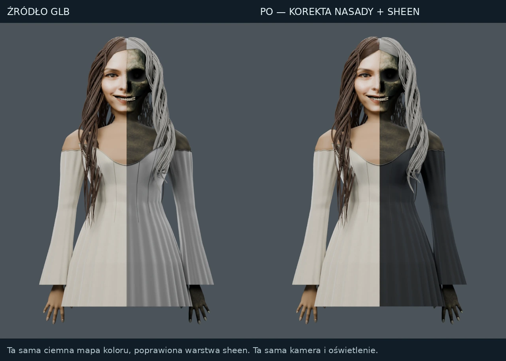

# Wznowienie generatora — wynik prac 2026-09-13

## Co zostało dostarczone

| Zakres | Wynik | Dowód |
| --- | --- | --- |
| Kod generatora Oracle v34 | Naprawiono rozpoznawanie atlasu w grupach węzłów i materiałach przypisanych do obiektu; dodano kompilację kodu przed kolejną próbą Blendera; oddzielono historię błędów od aktualnej walidacji. | Testowany commit `ad8844cd8d350c0af6939e1a0cda847dd87e3f9b`. |
| Zgodność z referencją | Usunięto instrukcję odrzucającą każde oko po stronie czaszki. Wymagania oka, włosów i stroju wynikają z aktualnej referencji. Host wymaga aktualnych dowodów powiązanych z eksportem zamiast samej deklaracji agenta. | Testy `test_reference_acceptance.py`, aktualizacja `codex_runner.py`. |
| Sprawdzenie kodu | 146 testów na Pythonie 3.9 oraz 146 na 3.12; rzeczywisty Codex/MCP z deterministycznym serwerem odpowiedzi, Blender 4.3, eksporty GLB/FBX, rendery, kontrola atlasów i szachownic. Oba zadania CI zakończone sukcesem. | [GitHub Actions 34730631366](https://github.com/teslaeco/Froge-MPC-2-test/actions/runs/34730631366). |
| Korekta dostępnego modelu E18R | Nowa lokalna nasada włosów: 960 zwężanych włókien i wypełnienie szczeliny. Naprawiony biały sheen czarnej sukni. Model ponownie wyeksportowany i zaimportowany do renderów. | [Porównanie E18/E18R](model-e18r/README-E18R.md). |
| Publiczna strona | Wersja 2 opublikowana; podglądy E18R, pobieranie rzeczywistego GLB, porównania i dotychczasowy formularz briefu oraz sklep pokazowy. | [FORGE Studio](https://forge-studio-public.terraformingplanet.chatgpt.site). |
| Nowe Julia / Atlas | Uporządkowano referencje i zgłoszone błędne wyniki. Nie wykonano korekty ich geometrii bez plików źródłowych. | [Analiza zgłoszeń](REFERENCE-CASES-2026-09-13.md). |

## Podgląd jest rzeczywistym modelem

E18R dotyczy wcześniejszej postaci w sukni, nie nowej Julii w bluzie. Głowa, oczy, szyja i sylwetka nie zostały przebudowane w tej korekcie. Podobieństwo twarzy i naturalność długich pasm wciąż są niewystarczające do deklaracji pełnego realizmu. „Przed” i „po” wyrenderowano z ponownie zaimportowanych GLB, tymi samymi kamerami, światłami i ustawieniami Cycles.

GLB E18R: 23 225 144 B, 6 354 061 trójkątów; SHA256 `6f8bef167a6d0e9dc67d4fce67df3782f0bdffb69ede54f8f62a799520f5b6db`.
[Poprawiony GLB](https://forge-studio-public.terraformingplanet.chatgpt.site/assets/model.glb).
[Zachowany źródłowy E18 GLB](https://forge-studio-public.terraformingplanet.chatgpt.site/assets/model-e18-source.glb).
Źródło publicznego Site: commit `8d716ebcccc107b5c542ffac03d2c417d62e3f35`; wersja 2; deployment `appgdep_6aa5fd40babc8191a8ad6efe181a99a3` zakończony `succeeded`.

Porównanie Meshy pozostaje porównaniem ze screenami użytkownika, z różnymi kamerami i światłem. Nie odzyskano pliku Meshy do nowego wspólnego testu. Widoczna na referencjach przewaga Meshy w podobieństwie nie została w tej sesji obalona. Nasze pomiary geometrii, naprawy materiałów i testy są uzupełnieniem takiego procesu, nie dowodem ogólnej przewagi produktu.

## Pozostałe ograniczenia

- Julia `076cb6e8-c3de-4a59-a7b9-c0dfeb2d0e0d` i Atlas `b653826a-1b24-44f5-a881-c0e0c2492a18`: pobranie aktualnych eksportów przez aplikację wymaga sesji właściciela (HTTP 401). Do edycji potrzebne są GLB albo BLEND pobrane z generatora. Nie przenosimy siwych włosów i sukni E18 do nowej Julii, której referencja pokazuje brązowe włosy po obu stronach, bluzę, T-shirt, jeansy i trampki.
- Prywatne Studio pozostaje w wersji 47. Klon źródeł zwraca HTTP 500, publikacja nie deklaruje serwera MCP. Publiczny pokaz jest odrębnym, istniejącym Site; formularz przygotowuje brief lokalnie, nie zleca płatnej generacji ani realizacji B2B.
- Brak aktywnego SSH Oracle: v34 jest przygotowaną i przetestowaną aktualizacją, a nie potwierdzoną instalacją. Nie zwiększono limitów konta ani budżetu płatnych modeli.
- Gate zgodności wymaga kompletu aktualnych widoków, pomiarów i dowodów powiązanych z eksportem. Obecny MCP nie tworzy automatycznie całego tego kompletu, więc niekompletne portrety pozostają wynikami roboczymi. To ochrona przed fałszywym zatwierdzeniem, nie samodzielne rozwiązanie rekonstrukcji.
- Testy szachownic sprawdzają geometrię, liczbę pól, przypisanie płaskich kolorów i wykrywanie celowych usterek. Nie są treningiem wag, pomiarem pikseli dowolnej tekstury ani uruchomieniem L4.
- Nie odzyskano oryginalnego mastera i map 4K wcześniejszego E18. Zachowane są źródłowy web GLB, nowy GLB, skrypty i porównania. Wcześniejsze Queen/film i dokumentacja pozostają na stronie; w tej sesji nie powstał nowy zwiastun.

Szczegółowe zgłoszenia i zasady korekt są zapisane w repo jako pamięć projektu. Nie oznacza to trwałej zmiany wag modeli OpenAI.

## Paczka Oracle

Instrukcja i potwierdzone hashe: [ORACLE-v34.md](../ORACLE-v34.md). Paczka jest zachowana w prywatnym repo jako `public/downloads/froge-v34.zip`; nie jest zainstalowana na serwerze. Payload odpowiada dokładnie udanemu CI. Nie wykonano płatnego testu nowej generacji.
