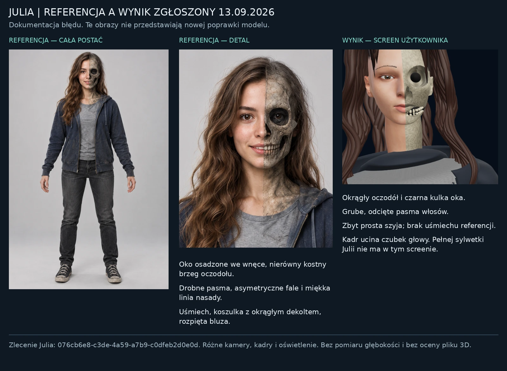
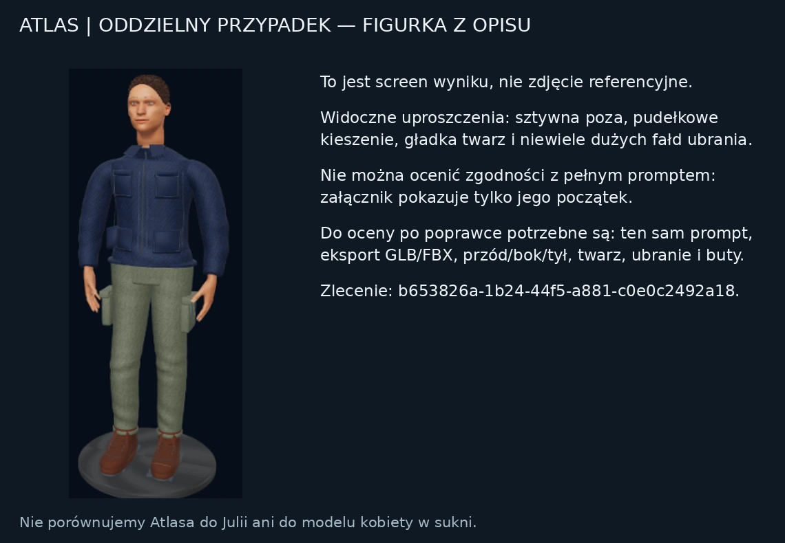

# Nowe przypadki referencyjne — 13 września 2026

To analiza wejściowych grafik i screenów, **nie raport z poprawionego modelu**. Nie ma tu nowego renderu 3D ani oceny pliku GLB/FBX zgłoszonego zlecenia. Oryginały zachowano. Kadry porównawcze zawierają wyłącznie przycięte i proporcjonalnie przeskalowane piksele załączników; nie wykonano generatywnego retuszu.

## Rozdzielenie zleceń

| Przypadek | Dowód | Co wiadomo |
|---|---|---|
| Julia w codziennym ubraniu | `ChatGPT Image 13 wrz 2026, 02_19_48.png` i screen `025146` | Nowa pełna referencja 1024 × 1536, żywa połowa po lewej stronie obrazu, kość i zagłębione ciemne oko po prawej; bluza, koszulka, jeansy, trampki. Zlecenie `076cb6e8-c3de-4a59-a7b9-c0dfeb2d0e0d`. |
| Atlas | Screen `021422` | Osobna figurka dorosłego fikcyjnego konstruktora tworzona z opisu. Zlecenie `b653826a-1b24-44f5-a881-c0e0c2492a18`. Widoczny tylko początek promptu, brak obrazowej referencji i pełnego raportu. |
| E15/E18, kobieta w sukni | Wcześniejsza historia i nowy film | Osobny model i strój. Ulepszenia runtime można przenieść, ale jego gotowy asset nie jest modelem Julii w bluzie. |
| Królowa Neptuna | Wcześniejsze porównania w filmie | Inna postać; nie zastępuje żadnej z powyższych. |

## Julia — diagnoza wizualna

1. **Oczodół i oko.** W referencji kostna krawędź jest nieregularna: podłuk brwiowy, osobny łuk jarzmowy i zwężenie przy nosie. Ciemne oko znajduje się w oczodole i zachowuje czytelną powiekę/głębię. Na screenie wyniku dominuje prawie okrągła jasna tuleja oraz jednolita czarna kulka, wizualnie odłączona od twarzy. Nie należy naprawiać tego przez zwiększenie promienia oka lub gładką sferyczną obwódkę.
2. **Włosy.** Referencja ma przesunięty przedziałek, gęstszą masę kasztanowych fal po lewej, drobne włókna i stopniowe zwężanie pasm. Prawa strona jest również brązowa — siwe włosy były poprzednim życzeniem artystycznym dla innej wersji i nie powinny automatycznie przenosić się do nowej referencji. Screen wyniku pokazuje równe grube sznury, spiczaste odcięte końce nad czołem i słabe połączenie ze skórą. Czubek głowy jest ucięty kadrem; samego wierzchołka nie da się ocenić z tego screenu, choć raport opisuje jego szczeliny.
3. **Nos i centralne połączenie.** Żywa połowa oraz kostna połowa powinny zachować wspólny kierunek grzbietu nosa. W wyniku kostny fragment wygląda jak dodatkowa bryła przy centralnym cięciu. Raport zgłasza dwa zaokrąglone otwory zamiast jednej spójnej anatomicznej wnęki. Sama linia podziału jest świadomą stylizacją referencji, a nie błędem do usunięcia.
4. **Usta i zęby.** Żywa część w referencji ma delikatnie uniesiony kącik i widoczne zęby. Wynik jest neutralny; kostny łuk i żywe usta nie tworzą tego samego uśmiechu. Widoczne korony sprawiają wrażenie luźnych, nierówno osadzonych małych klocków. Potrzebne są zamknięte, osadzone w łuku korony, kontakt sąsiadujących zębów i zgodna linia zgryzu; samo zaokrąglenie rogów nie wystarczy.
5. **Szyja i barki.** Referencja przechodzi z żuchwy przez szyję do obojczyków i ubrania bez ostrego cylindrycznego łącznika. Wynik pokazuje bardzo prostą, długą kolumnę. Należy dopasować osobno linię żuchwy, dolny obrys szyi i dekolt; nie skalować globalnie głowy. Pełne proporcje Julia–tułów pozostają nieocenione, bo nowy screen przedstawia jedynie zbliżenie.
6. **Ubranie.** Referencja to rozpięta granatowa bluza z kapturem, dwie rozdzielone kieszenie, zamek po obu stronach otwarcia, sznurki, szary T-shirt z miękkim okrągłym dekoltem, czarne jeansy, mankiety oraz ciemne wysokie trampki z jasnymi noskami i sznurówkami. Na zbliżeniu wynik ma niemal płaski front koszulki i gruby gładki wał kołnierza. Raport zgłasza również kanciastość kieszeni, kroku i butów; screen nie pozwala niezależnie potwierdzić tych części.
7. **Materiały.** Skóra referencji ma ciepły kolor, zróżnicowaną roughness i drobny detal. Kość ma lokalne różnice barwy i erozji skorelowane z jej formą. Wynik daje jednolitą jasną ziarnistość kości, plastikową skórę, jednolicie ciemne pasma i niewystarczające informacje materiału ubrania. Kolor nie może zawierać narysowanych pozornych powiek i bruzd, których nie ma w geometrii testu clay. Pory są detalem końcowym, po naprawie dużych kształtów.

## Julia — potwierdzone informacje z raportu na screenie

Poniższe dane są **odczytem raportu aplikacji**, nie ponownym pomiarem eksportu:

- `SyntaxError: invalid syntax (<unknown>, line 30)` przy wykonaniu instrukcji Astry.
- `ANATOMY_VALIDATION`, `structural_checks_passed: false`, naruszenie `skin_atlas`: brak atlasu skóry co najmniej 2048 px. Liczniki głowy/oczu/dłoni/paznokci w samym komunikacie są zgodne z oczekiwaniami.
- Ten sam opis podaje później skórę 2048 × 2048. Nie rozstrzyga to, czy komunikat dotyczy wcześniejszej próby, atlasu nieprzypisanego do głowy czy błędu stanu walidatora. Log musi przypisywać błąd do `attempt_id`, pliku i skrótu modelu, zamiast mieszać historię z końcowym stanem.
- 126 775 wierzchołków, 246 828 trójkątów, 186 obiektów, 11 obrazów.
- Ponowny import GLB raportuje jedną głowę, dwoje oczu, dwie dłonie i 10 paznokci. To potwierdzenie struktury, nie podobieństwa.
- Faktycznie ocenione podglądy: GLB 640 × 800, twarz 800 × 800. Nie dostarczono potwierdzonego renderu 8192 px ani kompletnego zestawu tekstur 8K.
- Mapy opisane w raporcie: skóra 2048², większość map kolorów 512², splot Normal 256², włosy Normal 4096 × 2048. Samo przeskalowanie ich do 8K nie doda informacji.
- Limit pięciu prób budowy został wyczerpany. Raport poprawnie określa wynik jako niezaakceptowaną wersję roboczą. Należy zachować draft, ale nie przedstawiać końca budżetu jako spełnienia warunku jakości.
- 27 zapytań API, limit 32; 20 663 tokeny odpowiedzi i rozumowania; budżet 96 000. Dostępny budżet tokenów nie jest dowodem, że każda iteracja wykonała skuteczną korektę. Potrzebne są skróty geometrii, obrazy przed/po i zapis nazwanych zmian.

## Mierzalne kryteria — bez pozornej precyzji z jednej fotografii

Są to proponowane kryteria QA, **nie uzyskane wyniki**. Pierwsza kontrola korzysta ze stałej kamery frontowej dopasowanej do obrazu. Skalowanie kadru musi być jednakowe dla obu osi; nie wolno rozciągać wybranej części twarzy na planszy porównawczej.

| Element | Pomiar z obserwowalnych danych | Warunek zaliczenia |
|---|---|---|
| Głowa i postawa | Punkty 2D: czubek włosów, podbródek, centra oczu, końce nosa, kąciki ust, końce rękawów i podeszwy. Normalizacja przez wysokość widocznej postaci. | Punkty zapisane z obrazem i niepewnością adnotacji; raport różnic przed/po. Brak arbitralnej zmiany globalnej skali głowy. |
| Szyja | Odległość podbródek–środek brzegu koszulki oraz boczne obrysy szyi w dopasowanym kadrze. | Poprawa obrysu i odległości względem wejścia; poza zakresem odsłoniętym na zdjęciu wynik jest rekonstrukcją, nie pomiarem. |
| Oczodół | Maska widocznego otworu i kontur jego brzegu; osobno maska oka. Render clay + normalny. | Oko istnieje i jest osadzone w oczodole, a kostny kontur nie jest pełnym okręgiem/tuleją. Ocena raycast wnętrza w pliku 3D; brak dowolnego progu głębokości wyprowadzonego z fotografii. |
| Uśmiech | Kąciki ust, linia zwarcia i widoczna szerokość koron w tym samym kadrze. | Zgodny kierunek uśmiechu po obu połowach, brak koron zawieszonych poza łukiem; kontrola przenikań i trzech ujęć. |
| Włosy | Kontur masy włosów, kierunek przedziałka, maska włosów nad czołem i odsłonięte szczeliny nasady. | Widoczna poprawa sylwety i nasad; w zbliżeniu włókna nie zastępują pustej czapki. Nie kopiować brązowo-siwego podziału z obcego zlecenia. |
| Ubranie | Osobne maski granatowej bluzy, szarego T-shirtu, jeansu, gumowych nosków; obecność kieszeni i rozpiętego zamka. | Wszystkie wymagane części obecne i zgodne kolorystycznie w neutralnym świetle; szwy/zamek również w geometrii lub poprawnie przypisanej mapie normal. |
| Tekstury | Realna rozdzielczość obrazów, przypisanie UV, kanały Base Color/Roughness/Normal, SHA256. | Raport nie zalicza samego rozmiaru pliku jako szczegółowości; materiał przechodzi ponowny import GLB/FBX. |
| Eksport | Skrót rzeczywistego modelu i każdego ocenionego renderu. | Wszystkie podglądy front/bok/tył/clay pochodzą z tego samego finalnego eksportu; brak podmiany starego assetu. |

Automatyczny próg błędu punktów należy skalibrować na pilotażowej grupie ręcznie zaakceptowanych modeli. Nie ma podstaw, aby arbitralne „2%” lub liczba trójkątów były dowodem fotorealizmu.

## Atlas — osobna diagnoza

Widoczny model ma poprawny ogólny rozkład kończyn, ale jest uproszczony: gładka twarz, sztywna poza, prawie cylindryczne rękawy, płaskie prostokątne kieszenie i ograniczona ilość fałd wskazujących napięcie ubrania. To obserwacja obrazu, nie dowód określonego błędu topologii. Z jednego małego ujęcia nie da się potwierdzić liczby palców, oczu, grubości ścian czy szczelności siatki.

Prompt rozpoczyna się: „Stwórz autorską fikcyjną figurkę dorosłego konstruktora Atlas. Nie odwzorowuj żadnego aktora ani istniejącej postaci. Na…”. Pozostałej części nie widać. Nie należy dopisywać wymagań twarzy lub stroju i deklarować później ich zgodności. Rozsądna kolejność QA: odzyskanie oryginalnego promptu i sceny → twarz/ręce → struktura kurtki i kieszeni → duże fałdy → zróżnicowana tkanina/skóra/guma → eksport i render porównawczy przy tej samej kamerze.

## Nowy film i screenshot historii

`886d2ed4263a4f285877eb1b43de90a2.mp4` ma 29,833333 s, 1080 × 1920, strumień HEVC i AAC. Próbki z dokładnych sekund 0/5/10/15/20/25 pokazują montaż screenów wcześniejszych porównań Meshy/FORGE, kolekcji obrazów i efektów przejść. Nie jest to czysty obrót aktualnego modelu Julii i nie pokazuje wsiadania do kapsuły. Nie wolno opisywać go jako technicznego dowodu nowego eksportu.

Screen `Screenshot_20260912-230917.png` potwierdza wcześniejszą rozmowę i podział pracy między agentów, ale nie dowodzi, że trening wag lub wdrożenie Oracle zakończyły się sukcesem. Wznowienie wymaga checkpointu i aktualnego stanu repo/serwera.

## Pliki dowodowe

- `evidence-manifest.json` — źródła, ich SHA256, wymiary, cropy i identyfikatory zleceń.
- `build-evidence-board.py` — odtwarzalny mechaniczny montaż porównania.
- `JULIA-reference-vs-reported-failure.png/.webp` — pełna referencja, detal i zgłoszony wynik.
- `ATLAS-reported-failure.png/.webp` — osobno Atlas, bez udawanej obrazowej referencji.
- `video-contact.jpg` — tylko lokalny przegląd wejściowego filmu; niepotrzebny do publicznego benchmarku.

Ostateczne porównanie po poprawce musi dodać rzeczywisty eksport i jego render. Obecne plansze nie zawierają pola „PO”, ponieważ nowy model nie został tu wykonany.
