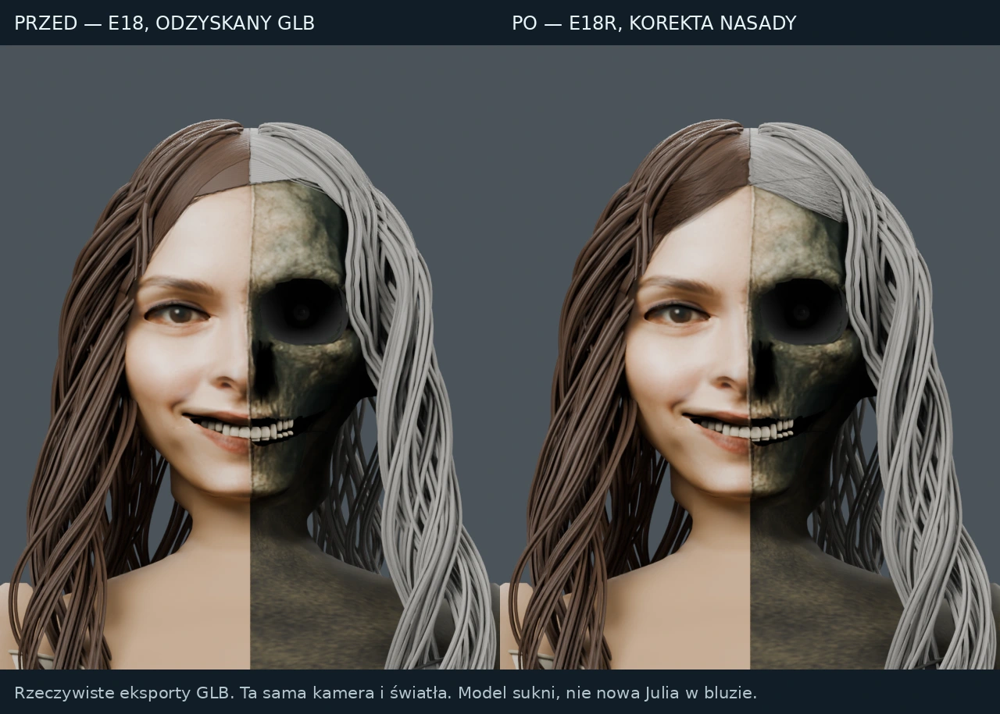
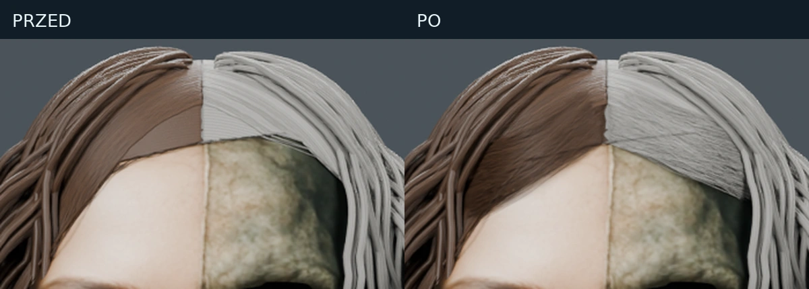

# E18R — wznowiona lokalna korekta nasady włosów

**Dotyczy wcześniejszej postaci w dwukolorowej sukni. Nie jest to poprawka nowego zlecenia Julii w bluzie ani Atlasa.** Źródłem był faktyczny publiczny plik E18 GLB, odzyskany po usunięciu wcześniejszych plików roboczych przez automatyczne porządkowanie miejsca.

## Wykonana zmiana

- Usunięto starszą frontalną warstwę włosów, której pasma tworzyły płaską powierzchnię nad czołem: 393 832 trójkąty.
- Wprowadzono 960 zwężanych włókien z krzywizną, zróżnicowanym odsunięciem od powierzchni i UV wzdłuż włókna. Nowa lokalna geometria ma 432 270 trójkątów.
- Podłoże nasady dostało osobny, ciemniejszy materiał. Zmiana nie modyfikuje współdzielonych materiałów pozostałych pasm.
- Zagęszczono początek włókien przy przedziałku, po tym jak render kontrolny ujawnił odsłonięty trójkąt podłoża po usunięciu starszej warstwy.
- Skorygowano nadmierny biały sheen czarnej tkaniny w odzyskanym GLB. Mapa Base Color była poprawnie ciemna (średnio RGB około 8/9/8), lecz materiał zawierał `sheenColorFactor [1,1,1]`. W checkpointcie Blendera zmniejszono wagę sheen do 0,15 i ustawiono tint [0,07; 0,08; 0,10]. Eksport glTF zachował przede wszystkim ten ciemny `sheenColorFactor`; nie przemalowano mapy koloru. Oceniane obrazy pochodzą z ponownego importu, nie z samego checkpointu.
- Geometria głowy, czaszki, oczu, szyi, korpusu i stroju pozostała niezmieniona w skrypcie budującym. Nie zwiększono globalnie skali głowy ani poziomu subdivision.

Liczba trójkątów: **6 315 623 → 6 354 061**. Przyrost netto to 38 438, a nie globalne zagęszczenie modelu. Sama ta liczba nie dowodzi poprawy podobieństwa.

## Dowód wizualny i kontrola eksportu

„Przed” został ponownie wyrenderowany z odzyskanego źródłowego GLB; „po” pochodzi z ponownego importu nowego GLB. Oba mają tę samą kamerę, światła, transformację barw AgX, rozdzielczość 640 × 800 i 32 próbki Cycles. Nie zestawiono nowego renderu z dawnym podglądem o innym oświetleniu.

`render-verification.json` zapisuje skróty plików modelu i każdego obrazu, liczbę siatek/trójkątów po ponownym imporcie oraz realne rozmiary odzyskanych obrazów tekstur. `correction-report.json` zapisuje zakres zmiany i statystyki budowy. Oceniane widoki końcowe: twarz, przód, lewy bok i tył. Dodatkowy render przodu źródła pozwala porównać zachowanie czarnej tkaniny przed i po korekcie sheen.

## Granice tej poprawki

To korekta lokalnej warstwy nasady, a nie pełna realistyczna rekonstrukcja. Długie pasma wciąż są mocno pogrupowane. Czaszka, nos, powieki, uśmiech, szyja i szczegółowość map stroju zachowują wcześniejsze ograniczenia. Naprawa warstwy sheen nie odtwarza brakujących tekstur master. Nie ma podstaw do ogłoszenia pełnej zgodności z referencją ani wyższości nad Meshy na podstawie tego jednego testu.

Zachowano brązowo-siwy podział włosów poprzedniej wersji sukni. Nowa referencja Julii w bluzie ma brązowe włosy po obu stronach i musi być obsłużona osobnym zleceniem.

## Odzyskany plik a oryginalny master

`FORGE-E18R.glb` jest nowym rzeczywistym eksportem opartym na odzyskanej wersji web. `FORGE-E18R-recovered-checkpoint.blend` to skompresowany checkpoint odtworzony z tej geometrii i obrazów. **Nie odzyskano oryginalnych tekstur 4K, wszystkich proceduralnych materiałów, wcześniejszej historii modyfikatorów ani pełnego pliku master.** Nie należy nazywać checkpointu oryginalnym masterem E18.

Mniejszy GLB można trwale przechować w repo lub jako asset witryny i ponownie zaimportować do Blendera. Zachowanie samego linku do tymczasowego BLEND nie zabezpiecza tego pliku przed kolejnym porządkowaniem miejsca. Skrypt i nowy GLB umożliwiają odtworzenie tej konkretnej korekty, ale nie przywracają utraconych danych oryginalnego mastera.

## Odtwarzanie

1. Umieść wejściowy E18 GLB jako `public-resume/dist/assets/model.glb`; jego SHA256 musi odpowiadać `source_sha256` w raporcie.
2. Uruchom Blender 4.3.0 z `inventory.py`, aby zaimportować źródło i utworzyć `source-recovered.blend`.
3. Uruchom `correct.py`. Skrypt używa stałego ziarna 13092026.
4. Uruchom `render-exports.py`, który otwiera rzeczywiste GLB „przed” i „po”.
5. Uruchom `make-comparisons.py`; tworzy wyłącznie mechaniczny montaż już wyrenderowanych obrazów.

Ścieżki robocze są jawnie zapisane w skryptach. Przed odtworzeniem w innym katalogu należy zmienić `ROOT`, bez modyfikowania wejściowych danych modelu.

## Trwałe pliki w podglądzie projektu

[Poprawiony E18R GLB](https://forge-studio-public.terraformingplanet.chatgpt.site/assets/model.glb) · [Źródłowy E18 GLB](https://forge-studio-public.terraformingplanet.chatgpt.site/assets/model-e18-source.glb). Manifest podaje SHA256; przed odtworzeniem sprawdź zgodność pobranego źródła i umieść je pod ścieżką wejściową używaną przez skrypty.
